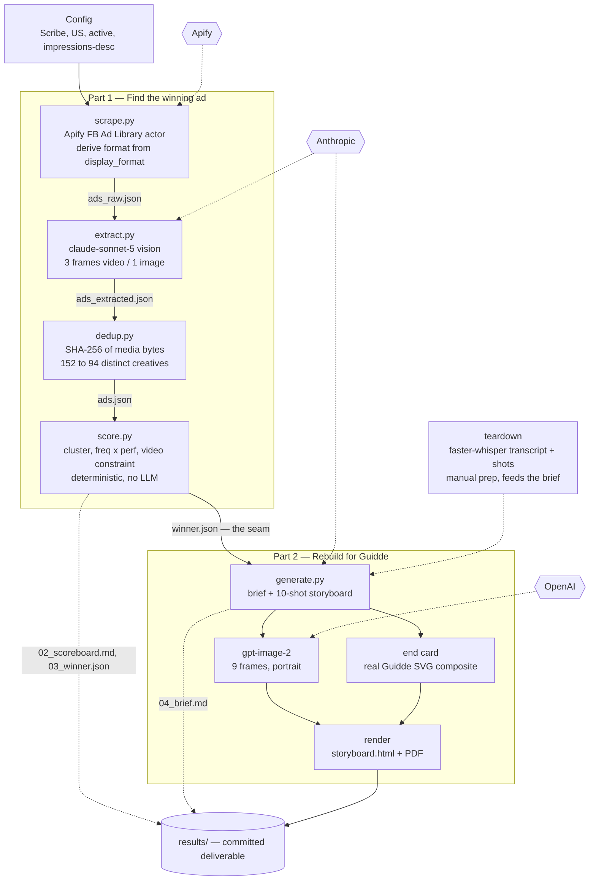

# Guidde take-home — competitor ad intelligence → creative brief

A two-part pipeline. **Part 1** scrapes a competitor's Facebook ads, defines "best" without
any spend or performance data, and ranks them to surface one winning creative. **Part 2**
tears that winner down and rebuilds its *formula* as a Guidde creative brief and shot-by-shot
storyboard. The winner and the rebuild are joined by one file — `data/winner.json` — so it's
genuinely two parts, one pipeline.

Run order is fixed: `scrape → extract → dedup → score → generate`.

The winning ad is Scribe's `1155616497059211` — a video talking-head testimonial that
demonstrates the product — and the rebuild adapts its structure (not its script) into a
Guidde ad.

---

## The deliverable — open this first

**[`results/storyboard.html`](results/storyboard.html)** — the creative brief and all 10
storyboard shots in one page. Self-contained: every frame is embedded, so it renders by
double-click in any browser, even if the file is moved or emailed.
**[`results/storyboard.pdf`](results/storyboard.pdf)** is the same content if you prefer PDF.

Part 1's reviewable artifacts sit alongside them: `results/02_scoreboard.md` (the ranked
pattern table), `results/03_winner.json` (the winning creative), and `results/04_brief.md`
(the Guidde creative brief).

---

## How I defined "best"

Meta's Ad Library exposes no spend, impressions, or performance data for commercial ads, so
"best" had to be inferred from proxies rather than measured. I defined the best ad as **the
highest-performing execution of Scribe's most-repeated, durability-proven creative formula** —
a definition built to survive the absence of ground-truth metrics.

Rather than crown a single eye-catching ad, I clustered Scribe's distinct creatives by
structural pattern (`format` + `structure_type`), deliberately holding the rotating use-case
*out* of the cluster key since that's the variable Scribe tests, not the pattern itself. The
logic is that repetition is revealed preference: an advertiser who reproduces a format dozens
of times is telling you, with budget, what converts. But frequency alone can signal "cheap to
produce" rather than "proven to work," so I scored each pattern on two independent axes and
combined them as a **product, not a sum**:

```
PatternScore(cluster) = norm(frequency) × norm(performance)
```

where `frequency` is how heavily Scribe repeats the pattern and `performance` blends reach
standing (Meta's impressions-descending sort order) with longevity (advertisers kill losers
fast, so survival is evidence). The product form means a pattern wins only if it is *both*
heavily repeated *and* its instances survive and scale; a large cluster that churns out quickly
and a lone high-performing one-off are both correctly rejected.

The single winning ad is then the top performer within the winning cluster. Structural
distinctiveness — which I initially over-weighted — was demoted to an outlier flag: distinct,
infrequent creatives (≤ 2 in a cluster) are reported as likely experiments and excluded from
selection, not mistaken for proven heroes.

**Winner selection is restricted to video** (`WINNER_FORMATS = ("video",)`) because Part 2
requires a shot-by-shot storyboard, which a static image cannot support. The scoring math is
untouched and the full ranked table still prints every cluster — including the finding that
static formats dominate Scribe's mix (the *unconstrained* winner is `image/text_animation`).
Both winners are printed and recorded.

*This is one defensible reading, not a determined result — see Limitations for where it's
sensitive.*

---

## Choosing the competitor

The assignment's four suggested competitors were a hypothesis, not a given, so I qualified each
against two gates before scraping anything: **(1) is it a real, rankable Facebook ad program?**
and **(2) does its positioning transfer to Guidde's documentation/capture use case?** Only
Scribe cleared both. This manual pass is deliberate cost control — cheap human filtering
protects the expensive scrape/LLM stage from processing dead ends — and it narrowed scope to a
single deep competitor, which the assignment explicitly permits when justified.

| Competitor | Real FB ad program? | Positioning fit to Guidde | Decision |
|---|---|---|---|
| **Scribe** | Yes — a rich, actively-tested program | Match — step-by-step capture / documentation | **Scrape & analyze** |
| Loom | No — absorbed into Atlassian; only thin tutorial content under its name | (n/a) | Drop — not an ad operation |
| Camtasia | Yes — substantial program | Mismatch — video *production* (AI avatars, localization, editing) | Drop — off-positioning |
| WalkMe | Yes | Mismatch — enterprise AI-adoption / digital adoption | Drop — off-positioning |

The three drops fail for two *distinct* reasons — Loom on gate 1, Camtasia and WalkMe on gate 2 —
which is why this reads as a qualification system rather than post-hoc justification for landing
on one name.

---

## How the pipeline works

Each stage reads a file and writes a file; stages are independent and individually testable.

1. **`scrape.py`** — pulls Scribe's active US ads from the Meta Ad Library via the Apify actor
   (the official Ad Library *API* can't see US commercial ads, so the public web library is
   scraped instead). Derives true `format` from `display_format`; ranks by Meta's
   impressions-descending sort. → `data/ads_raw.json`
2. **`extract.py`** — one `claude-sonnet-5` vision call per ad fills a fixed schema
   (`format`, `structure_type`, hook, angle, CTA, …). Video ads are read from 3 sampled frames;
   image ads from one. → `data/ads_extracted.json`
3. **`dedup.py`** — collapses duplicate creatives by SHA-256 of the media bytes (152 records →
   94 distinct creatives), re-ranks densely, resolves label conflicts by majority vote.
   → `data/ads.json`
4. **`score.py`** — deterministic. Clusters, scores `frequency × performance`, applies the video
   constraint, picks the winner. No LLM. → `data/winner.json`, `results/02_scoreboard.md`,
   `results/03_winner.json`
5. **`generate.py`** — writes the Guidde brief and a 10-shot storyboard, generates 9 frames with
   `gpt-image-2`, composites the branded end card, renders HTML + PDF.
   → `results/04_brief.md`, `results/storyboard.{html,pdf}`, `results/05_storyboard/`

A separate manual step produced `data/preview/winner_teardown.md` — a transcript-and-shot
teardown of the winning video (the pipeline never processes audio, so this captures what the
frame-only extraction missed). It's the raw material for Part 2.

---

## Architecture



---

## Running it from a clean machine

```bash
# 1. clone, then set up a virtual environment
python -m venv .venv
source .venv/bin/activate          # Windows: .venv\Scripts\activate
pip install -r requirements.txt

# 2. credentials
cp .env.example .env               # then fill in the three keys (see below)

# 3. run the pipeline in order
python src/scrape.py
python src/extract.py
python src/dedup.py
python src/score.py
python src/generate.py
```

**Python 3.14 note:** on some 3.14 setups `python -m venv` fails on `ensurepip` and the venv is
created without pip. If `pip install` fails, either use a 3.11–3.12 interpreter, or bootstrap pip
into the venv's site-packages with a user-level pip. (This is an environment quirk, not a code
issue — the pipeline itself is plain Python.)

`score.py` and `dedup.py` need no network or keys. `data/` is regenerated each run and is
gitignored; `results/` is committed as the real-run output.

---

## Providers, credentials & cost per run

Three external providers, each behind an environment variable in `.env` (`.env.example` lists
the names, no values):

| Stage | Provider | Model / actor | Credential | Cost per run |
|---|---|---|---|---|
| scrape | Apify | `curious_coder/facebook-ads-library-scraper` ($0.00075/ad) | `APIFY_TOKEN` | ~$0.11 (≈152 ads × $0.00075) |
| extract | Anthropic | `claude-sonnet-5` (vision) | `ANTHROPIC_API_KEY` | ~$1 (one vision call per ad) |
| generate | OpenAI | `gpt-image-2` (images) + `claude-sonnet-5` (copy) | `OPENAI_API_KEY` + Anthropic | ~$0.50 (10 images + brief/shot copy) |

**A clean end-to-end run is roughly \$1.50–2.00.** The Apify figure is exact (a fixed per-ad
rate); the LLM figures are approximate and vary with token counts and ad volume. `dedup` and
`score` are free (pure computation). The dominant cost is extraction — one vision call per ad —
so total cost scales with the number of ads, and caching already-extracted ads is the obvious
lever at higher volume. (These are the costs of one clean run; iterating during development cost
several times this.)

Transcription for the teardown used `faster-whisper` locally (no API) — prep tooling, not a
pipeline dependency, so it's deliberately not in `requirements.txt`.

---

## The winning ad & the Guidde rebuild

**Winner:** Scribe `1155616497059211` — a ~43-second vertical video talking-head testimonial,
`video/talking_head_testimonial`, that demonstrates the product mid-way through.

The teardown surfaced three things frame-only analysis could never see, and each shaped the
rebuild:

- **Story-first, ~80% narrative.** The product appears in only ~2 of 10 shots (~4.5s, ~10% of
  runtime), placed dead-center. The narrative "buys the right" to show the product — it is *not*
  a feature tour.
- **The edit accelerates into the demo.** Overall pacing is slow (~1 cut / 4.8s), but the two
  demo shots are the fastest cuts, bracketed by slow takes.
- **A status payoff, not a benefit claim.** The ad lands on career-visibility — being seen as the 
  one who knows how things work — never "saves you X hours." The Guidde rebuild carries this through: its message and CTA both turn on *proof* ("turn what you know into proof"), a credit-for-your-knowledge claim rather than an efficiency one.

The Guidde rebuild (`results/04_brief.md` + storyboard) mirrors that structure faithfully:
same earned-reveal arc, same accelerating edit, same status-leverage payoff — with Scribe's
scenario and product swapped for Guidde's. It carries the *formula*, not the script.

---

## Limitations & known issues

**Meta publishes no spend or impression data for commercial ads.** `impression_bucket`
is null for 83 of 94 creatives (the 11 that carry one carry `"<100"`, which is not a
tier in `BUCKET_MIDPOINTS`). So the reach signal is really Meta's impressions-descending
**sort order** — a relative standing, not a measured quantity. Every reach number in the
output is an ordering, and should be read as "ranked higher than", never as impressions.

**Fixed 2026-09-12 — a unit bug in `perf`.** `score.py` originally computed
`impressions_per_day = exposure / days_running`. That treats the reach signal as a
cumulative lifetime total, but the rank fallback is a current standing, so the division
was a unit error. It produced a 6.1x recency bias (median ipd 0.128 for creatives ≤7 days
old vs 0.021 for ≥30 days) and inverted longevity from evidence-of-proven-ness into a
penalty. The pre-fix winner was a rank-36, three-day-old creative. Reach is now a standing
in [0,1] and longevity is a separate positive term. `score.py` was unfrozen for this one
correctness fix; the definition of "best" (freq × perf, product form, clustering,
outlier threshold) is unchanged.

**Winner selection is restricted to video creatives.** Part 2 produces a shot-by-shot
storyboard, which a static image cannot support, so `WINNER_FORMATS = ("video",)` in
`score.py` limits which clusters are eligible to win. The scoring math is unchanged and the
ranked table still shows every cluster — including the finding that **static patterns
dominate Scribe's mix** (the unconstrained winner is `image/text_animation`). Both winners
are printed and `winner.json` records the unconstrained one alongside the selected one.

Note the constraint is doing real work: the two video clusters both score PatternScore
0.000 (see the min-max brittleness below), so the choice between them falls to a documented
tiebreak on cluster size — `video/talking_head_testimonial` (n=30) over
`video/text_animation` (n=3). The selected creative is `1155616497059211`.

**Storyboard frames are references; the end card is a brand composite.** Shots 1-9 are
AI-generated visual references (`gpt-image-2`, 1024x1536, portrait) — mood and composition
guides, not finished art, and deliberately free of text since image models garble type
(captions and VO are metadata beside each frame). Shot 10, the end card, is NOT generated:
it is assembled in HTML/CSS over the real Guidde vector wordmark (`assets/guidde_logo.svg`)
with the CTA as real type on a real button in Guidde red `#CB0000`. Brand lockups are
graphic elements an image model cannot render reliably, so the brand is applied as a real
vector overlay — which is also how it is done in production.

**The winner is NOT robust to the perf weighting.** The winning *cluster* flips between
`image/text_animation` and `image/screen_demo` depending on how reach and longevity are
weighted, and the winning *creative* changes under four of five weightings. See the
sensitivity table printed by `score.py`. Treat the winner as one defensible reading, not
a determined result.

**Min-max over 7 clusters makes PatternScore brittle.** Whichever cluster holds the
minimum on either axis is normalised to exactly 0 and its product collapses to 0 —
regardless of the other axis. `video/talking_head_testimonial` (n=30, the single
most-repeated pattern) scores 0.000 because it holds the minimum perf; `video/text_animation`
scores 0.000 despite the highest perf of any cluster, because it holds the minimum freq.

**Duplicate creatives.** Scribe runs everything as DCO and Meta registers one creative
under several `ad_archive_id`s — 152 records carry 94 distinct creatives. `dedup.py`
collapses them by SHA-256 of the media bytes before scoring. Two creatives whose duplicate
instances received conflicting labels were resolved by majority vote; one 1–1 tie was
resolved by a human viewing the creative (`MANUAL_LABELS` in `dedup.py`).

**`structure_type` is an LLM judgement.** `format` is ground truth from the scrape, but
structure is inferred — from 3 sampled frames for video ads, a single still for image ads.
Measured self-consistency: on identical media bytes the model disagreed with itself on
2 of 46 duplicate groups (~4%).

---

## What breaks at 10× volume

- **Apify cost and time scale linearly** — 10 competitors × more ads is ~\$1+ per scrape and
  minutes per run; rate-limits and actor timeouts become the first failure point, not the code.
- **Extraction cost dominates** — it's per-ad LLM vision calls, so 10× ads ≈ 10× the ~\$1 extract
  spend. Batching and caching (skip already-extracted `ad_id`s) would matter here; currently each
  run re-extracts.
- **Scoring gets *more* reliable, not less** — the min-max brittleness and 0.000 ties are a
  small-N artifact of having only 7 clusters. More competitors and more clusters would separate
  the distribution and reduce the reliance on tiebreaks.
- **Dedup scales fine** — SHA-256 hashing is cheap; hashes are cached.

---

## Next steps (what I'd build with more time)

- **Multi-frame everywhere + in-pipeline transcription.** `structure_type` is inferred from
  frames only; audio is never processed. Folding `faster-whisper` into the pipeline and sampling
  more frames would let structure be judged from motion *and* speech, and would remove the manual
  teardown step.
- **A softer normalization** than min-max (e.g. an epsilon floor) so a cluster at an axis-minimum
  isn't annihilated by the product — this would let the score, not a tiebreak, separate the top
  clusters.
- **Automated competitor qualification** — the two-gate filter (real ad program? positioning
  fit?) is currently manual; it could pull a category's top advertisers and rank by ad volume.
- **Unify the reach scale** — if a future competitor's ads mix real impression buckets with
  rank-standing fallbacks, those must be normalized to one scale before ranking.

---

## Repo layout

```
src/            scrape.py  extract.py  dedup.py  score.py  generate.py
docs/build/     01-scrape.md  02-extract.md  02b-dedup.md  03-score.md  04-generate.md
assets/         guidde_logo.svg
results/        02_scoreboard.md  03_winner.json  04_brief.md
                05_storyboard/ (9 frames)  05_storyboard.md  storyboard.html  storyboard.pdf
data/           (gitignored — regenerated each run)
```

Every pipeline stage has a spec in `docs/build/` written before (or, for stages that evolved on
contact with the data, alongside) its build. `CLAUDE.md` is the project context file that drove
the AI-assisted build.
