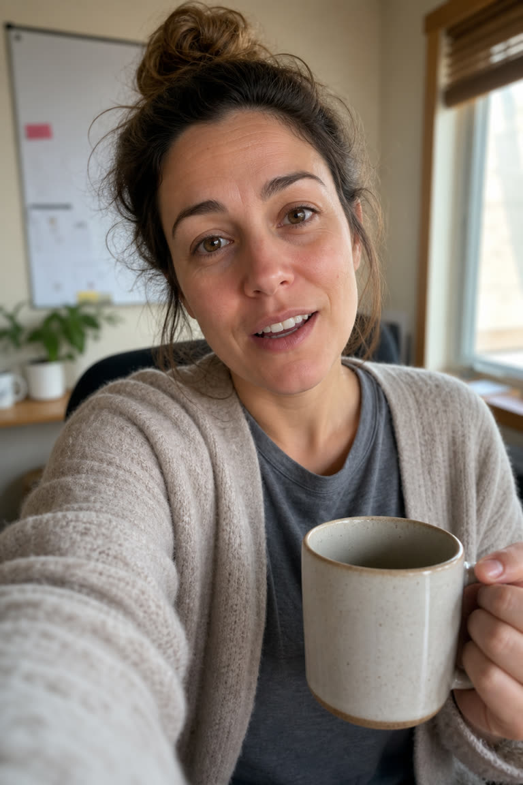
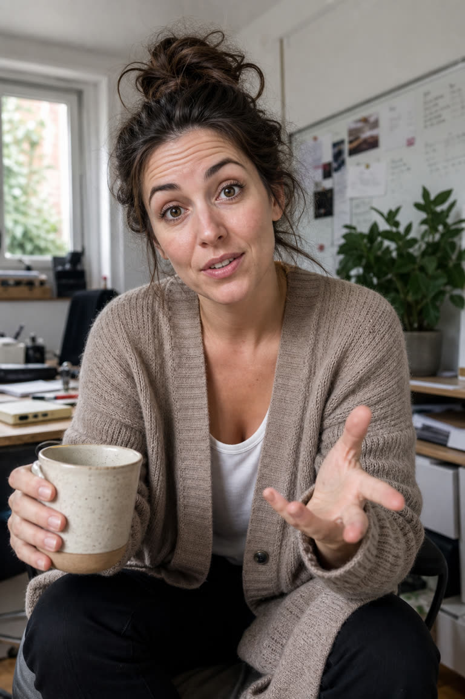
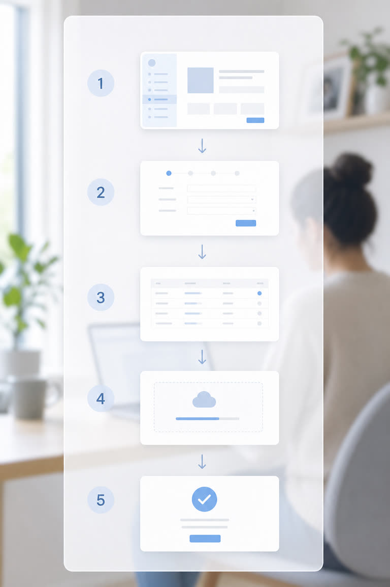
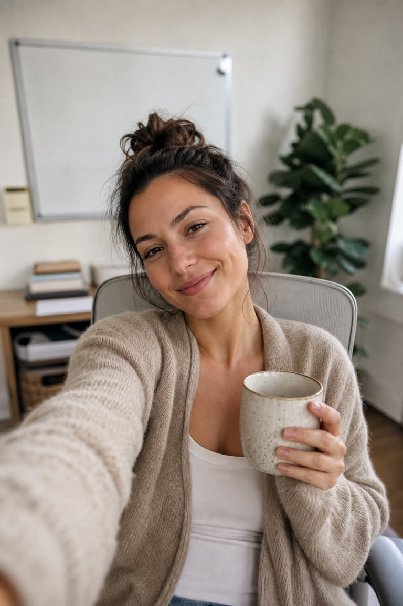
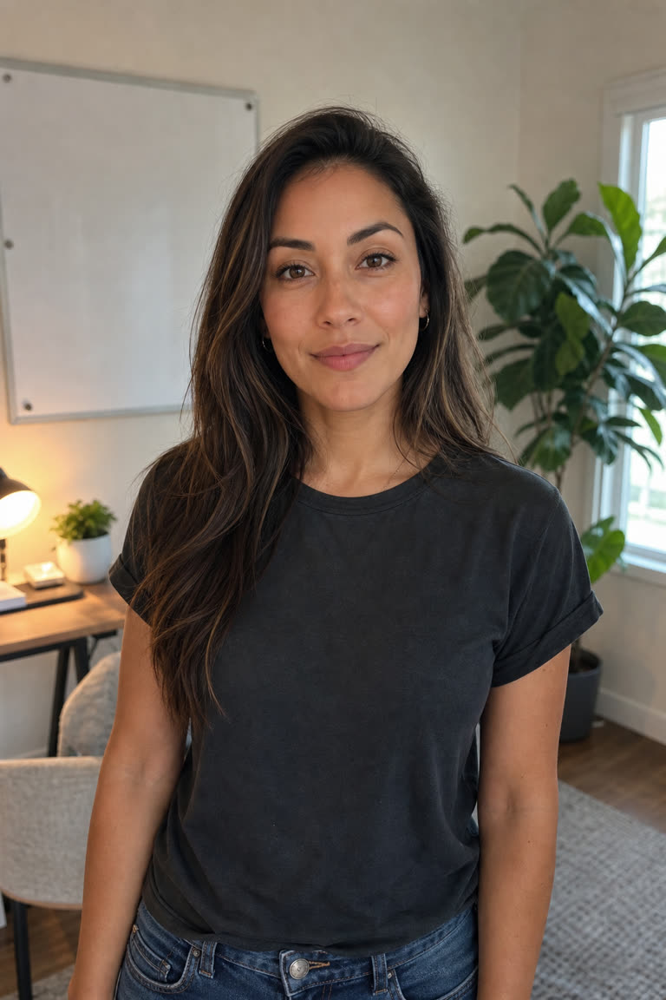

# Storyboard — 10 shots

Captions and VO are metadata beside each frame, never rendered into the image.

| # | Time | Beat | Pacing | Product | Frame |
|---|---|---|---|---|---|
| 1 | 0.0-4.6s | hook | slow take | no |  |
| 2 | 4.6-7.6s | problem | slow take | no |  |
| 3 | 7.6-15.5s | mechanism | slow take | no |  |
| 4 | 15.5-22.1s | mechanism | slow take | no |  |
| 5 | 22.1-24.6s | product_demo | fast cut | YES |  |
| 6 | 24.7-26.6s | product_demo | fast cut | YES |  |
| 7 | 26.6-30.1s | payoff | slow take | no |  |
| 8 | 30.1-33.0s | payoff | slow take | no |  |
| 9 | 33.0-40.0s | payoff | slow take | no |  |
| 10 | 40.0-43.0s | cta | slow take | no | _brand composite (see storyboard.html)_ |

## Shot 1 — 0.0-4.6s (4.6s, slow take)

- **Beat:** hook
- **Product on screen:** no
- **Visual:** Presenter close on phone camera, mug in hand, mid-sentence, direct eye contact, casual home office behind her.
- **VO:** If you're the only one who knows how something works, don't panic every time you go on vacation. Record it instead.
- **Caption:** don't panic. record it instead.

## Shot 2 — 4.6-7.6s (3.0s, slow take)

- **Beat:** problem
- **Product on screen:** no
- **Visual:** Presenter leans in slightly, more animated, conceding the obvious reaction before rejecting it.
- **VO:** Most people just wait for the fire. I used to be that person too.
- **Caption:** i used to be that person too

## Shot 3 — 7.6-15.5s (7.9s, slow take)

- **Beat:** mechanism
- **Product on screen:** no
- **Visual:** Presenter gestures broadly while explaining the behaviour change, camera holds steady on her talking.
- **VO:** So I stopped being the single point of failure. Every fix, every workaround, every 'wait, how'd you do that' — I started capturing it live, the moment it happened.
- **Caption:** i started capturing it live

## Shot 4 — 15.5-22.1s (6.6s, slow take)

- **Beat:** mechanism
- **Product on screen:** no
- **Visual:** Presenter points at camera, building toward the reveal of the tool, tone confident.
- **VO:** Guidde makes that automatic. I'm not writing anything, I'm not slowing down to explain twice. I just work — and it turns out documented.
- **Caption:** i just work. it turns out documented

## Shot 5 — 22.1-24.6s (2.5s, fast cut)

- **Beat:** product_demo
- **Product on screen:** yes
- **Visual:** Screen-capture overlay appears over the presenter: a generic software interface recording her steps in real time, cursor moving, a step being highlighted as it's clicked.
- **VO:** I walk through the process once,
- **Caption:** i walk through it once

## Shot 6 — 24.7-26.6s (1.9s, fast cut)

- **Beat:** product_demo
- **Product on screen:** yes
- **Visual:** Overlay shifts to the finished artifact: a clean auto-generated step-by-step guide with numbered steps and screenshots, scrolling briefly.
- **VO:** and it builds the full guide — screenshots and all — automatically.
- **Caption:** it builds the guide automatically

## Shot 7 — 26.6-30.1s (3.5s, slow take)

- **Beat:** payoff
- **Product on screen:** no
- **Visual:** Presenter back in full frame, relaxed, recounting the first outcome.
- **VO:** Now when someone asks how to do the thing, I don't hop on a call. I send a link.
- **Caption:** i send a link

## Shot 8 — 30.1-33.0s (2.9s, slow take)

- **Beat:** payoff
- **Product on screen:** no
- **Visual:** Presenter shrugs lightly, unbothered, describing a second scenario.
- **VO:** When I'm out sick, nobody waits on me. They open a guide.
- **Caption:** nobody waits on me

## Shot 9 — 33.0-40.0s (7.0s, slow take)

- **Beat:** payoff
- **Product on screen:** no
- **Visual:** Presenter delivers the closing status line with quiet confidence, steady eye contact, no props.
- **VO:** When leadership finally mapped out who actually keeps this place running, my name was on half the docs. At this point, I'm too visible to overlook and too proven to pass over.
- **Caption:** too visible to overlook. too proven to pass over.

## Shot 10 — 40.0-43.0s (3.0s, slow take)

- **Frame type:** BRAND COMPOSITE — real Guidde vector wordmark (`assets/guidde_logo.svg`) over a clean plate, CTA set as a real button in Guidde red `#CB0000`. NOT an AI-generated frame: image models cannot render a logo lockup or legible CTA type reliably.
- **Beat:** cta
- **Product on screen:** no
- **Visual:** Cut to a clean static end card: logo mark, short headline, a button shape, and a URL line, held on screen.
- **VO:** If that sounds like you, go make yourself impossible to overlook.
- **Caption:** try guidde free — guidde.com

